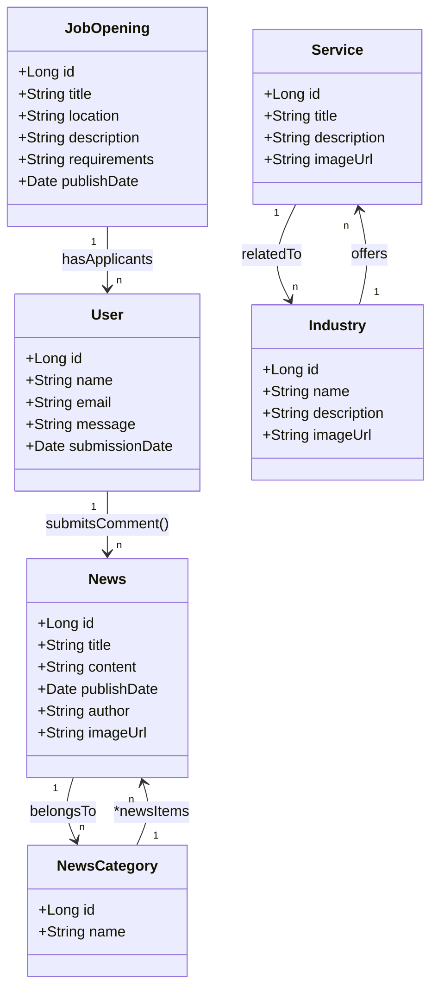

# Decola Tech Avanade 2025
Java RESTful API criada para o Decola Tech Avanade2025

## diagrama de Classes ##

```mermaid
classDiagram
    class User {
        +Long id
        +String name
        +String email
        +String message
        +Date submissionDate
    }

    class Service {
        +Long id
        +String title
        +String description
        +String imageUrl
    }

    class Industry {
        +Long id
        +String name
        +String description
        +String imageUrl
    }

    class News {
        +Long id
        +String title
        +String content
        +Date publishDate
        +String author
        +String imageUrl
    }

    class NewsCategory {
        +Long id
        +String name
    }

    class JobOpening {
        +Long id
        +String title
        +String location
        +String description
        +String requirements
        +Date publishDate
    }

    User "1" --> "n" News : submitsComment()
    News "1" --> "n" NewsCategory : belongsTo
    NewsCategory "1" --> "n" News : *newsItems

    JobOpening "1" --> "n" User : hasApplicants

    Industry "1" --> "n" Service : offers
    Service "1" --> "n" Industry : relatedTo
```
